# WordHunter

## 需求分析

1. 闯关者，出题者的注册、登录。

2. 出题者增加游戏中使用单词。游戏每一关，程序会根据该关卡难度，
显示一个或多个单词，一定时间后单词消失。
闯关者需要在相应地方输入刚刚显示并消失的单词，如果闯关者输入正确则为通过。

3. 任何角色均可查询所有闯关者、出题者，按照属性查找相应闯关者、出题者。

4. 可以根据闯关者闯过关卡数、经验、等级等对闯关者排名，
根据出题者出题数目、等级对出题者排名。

5. 每一关难度的增加体现为

    * 单词难度（即长度）随关卡数增加

    * 单词个数随关卡数增加

    * 单词显示时间随关卡数增加而缩短

6. 游戏自带词库，已经出题者可以为系统出题，已经存在的单词不能再次添加。
使用数据库存储单词，根据关卡难度从数据库中随机选取单词。

7. 设计闯关者和出题者经验值，等级增加策略。

8. 通过socket进行通信。

9. 完成服务器端和客户端程序，客户端可以启动多个同时与服务器交互。

10. 实现匹配对战功能，要求闯关者均已登录，两人题目相同，
根据正确率和用时来决出胜负。

## 编程环境

Windows 10 PC机，Qt 5.12.2 + Qt Creator 4.8.2 开发环境

## 模块关系

### 客户端模块关系图

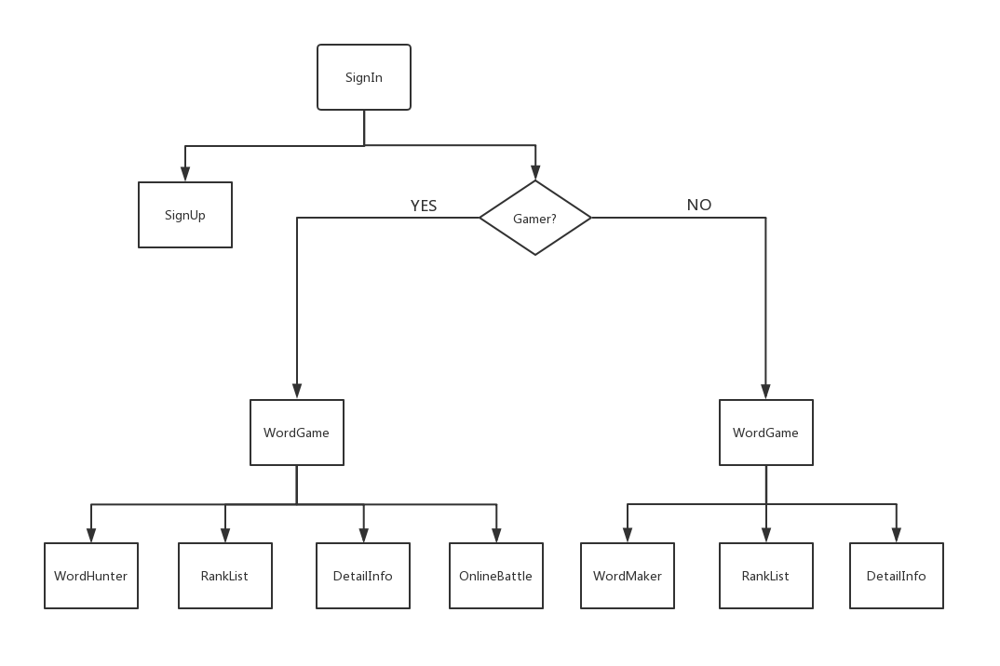

### 服务器端模块关系图

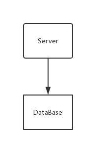

## 程序实现

利用面向对象的方法编写程序，使用Qt进行GUI的设计，socket和json进行网络通信，
sqllite数据库存储用户信息及单词。

### 游戏主体

#### 用户类

子类Gamer和Examer继承父类User的属性，同时增添了自己独有的属性，闯关者和
出题者的账号不互通。

父类 User

```cpp
class User
{
public:
    User(QString nn, QString un, int lv, int exp);
    User();
    ~User();

    QString getNickname() const;                // 获取昵称
    QString getUsername() const;                // 获取用户名
    int getLevel() const;                       // 获取等级
    int getExperiencePoint() const;             // 获取经验值
    void changeNickname(QString newNickname);   // 修改昵称
    void addExp(int expAddition);       // 加经验
    void subExp(int subtrahend);        // 减经验
protected:
    void addLevel(int levelAddition);   // 升级
private:
    QString nickname;       // 昵称
    QString username;       // 用户名
    int level;              // 等级
    int experiencePoint;    // 经验
};
```

子类 Gamer

```cpp
class Gamer: public User
{
public:
    Gamer();
    Gamer(QString nn, QString un, int lv, int exp, int passNum);
    ~Gamer();
    Gamer(const Gamer&) = default;

    int getPassedStageNumber() const;   // 获取已闯关数
    void addStage(int stageAddition);   // 增加已闯关数
private:
    int passedStageNumber;              // 已闯关数
};
```

子类 Examer

```cpp
class Examer: public User
{
public:
    Examer();
    Examer(QString nn, QString un, int lv, int exp, int questionNum);
    ~Examer();
    Examer(const Examer&) = default;

    int getQuestionNumber() const;                  // 获取已出题数
    void addQuestionNumber(int questionAddition);   // 增加已出题数
private:
    int questionNumber;     // 已出题数
};

```

#### 客户端通信

客户端Client使用TCP与服务器进行通信，Client提供了一系列发送消息函数供其它模块调用，
利用json传输数据，服务器解析之后通过不同的功能号进行区分。

```cpp
/* 功能号用于向服务器请求不同的服务 */
enum FUNCTION
{
    GAMER_SIGNIN,
    EXAMER_SIGNIN,
    GAMER_SIGNUP,
    EXAMER_SIGNUP,
    GAMER_SIGNOUT,
    EXAMER_SIGNOUT,
    GET_GAMERINFO,
    GET_EXAMERINFO,
    ADDWORD,
    GETWORD,
    GET_GAMERRANKLIST,
    GET_EXAMERRANKLIST,
    UPDATE_GAMERINFO,
    UPDATE_EXAMERINFO,
    GAMERMATCH,
    GET_PKRESULT,
    CANCELMATCH,
    UPDAT_PKINFO
};
/* 用户状态 */
enum STATE
{
    OFFLINE,
    ONLINE,
    WRONGPASSWD,
    NOUSER,
    MATCHING,
    PKING,
    PKEND,
    MATCHSUCCESS,
    MATCHFAILURE_MATCHING,
    MATCHFAILURE_PKING,
    WIN,
    LOSE,
    DRAW,
    WAIT
};

class Client: public QWidget
{
    Q_OBJECT

public:
    Client(QWidget *parent = nullptr);
    ~Client();
    void initClient();              // 客户端初始化
    void connectServer();           // 连接服务器
    QTcpSocket* getInfoSender();    // 获取服务器发来的消息

    /* 重载sendInfo函数供其它模块发送不同的消息使用 */
    void sendInfo(FUNCTION func, QString username, QString password);
    void sendInfo(FUNCTION func, QString nickname, QString username, QString password);
    void sendInfo(FUNCTION func, GamerInfo gamer);
    void sendInfo(FUNCTION func, ExamerInfo examer);
    void sendInfo(FUNCTION func, int difficultDegree);
    void sendInfo(FUNCTION func);
    void sendInfo(FUNCTION func, QString str);
    void sendInfo(FUNCTION func, QString username, int correctNum, int time);

    /* 获取服务器端的json数据进行解析 */
    QJsonObject getInfo();
    QJsonArray getArrayInfo();
private:
    void sendInfo(QJsonObject infoObject);
private slots:
    void displayError(QAbstractSocket::SocketError);    // 用于输出错误信息
private:
    QTcpSocket *infoSender;
};

```

#### 注册&登录界面

登录界面SignIn类，继承自QDialog

```cpp
class SignIn: public QDialog
{
    Q_OBJECT

public:
    explicit SignIn(QWidget *parent = nullptr);
    ~SignIn();
protected:
    void initUI();
private:
    /* 按钮、输入框等元素及其布局 */
    QLabel *usernameLabel, *passwordLabel;
    QLineEdit *usernameLineEdit, *passwordLineEdit;
    QRadioButton *gamerButton, *examerButton;
    QPushButton *signinButton, *signupButton;
    QButtonGroup *selectButton;

    QGridLayout *selectUserLayout;
    QGridLayout *signinLayout;

    /* 登录成功后启动主界面 */
    WordGame *wordgame;

    /* 用于服务器通信 */
    Client *client;
private slots:
    /* 槽函数用于处理按钮点击事件 */
    void on_signinButton_clicked();
    void on_signupButton_clicked();
    /* 服务器端消息的处理 */
    void readInfo();
};
```

界面效果如下

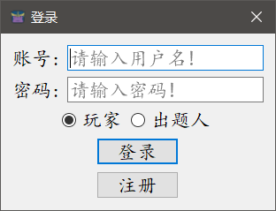

登录界面SignUp类，继承自QDialog

```cpp
class SignUp: public QDialog
{
    Q_OBJECT

public:
    explicit SignUp(QWidget *parent = nullptr);
    ~SignUp();
protected:
    void initUI();
private:
    /* 按钮、输入框等元素及其布局 */
    QLabel *nicknameLabel, *usernameLabel, *passwordLabel, *rePasswordLabel;
    QLineEdit *nicknameLineEdit, *usernameLineEdit, *passwordLineEdit, *rePasswordLineEdit;
    QRadioButton *gamerButton, *examerButton;
    QPushButton *signupButton;
    QButtonGroup *selectButton;

    /* 用于服务器通信 */
    Client *client;
private slots:
    /* 槽函数用于处理按钮点击事件 */
    void on_signupButton_clicked();
    /* 服务器端消息的处理 */
    void readInfo();
};
```

界面效果如下

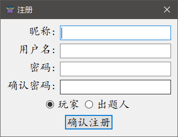

#### 游戏主界面

主界面WordGame类，继承自QMainWindow，通过QTabWidget整合子界面

```cpp
class WordGame: public QMainWindow
{
    Q_OBJECT

public:
    WordGame(Gamer _gamer, QWidget *parent = nullptr);
    WordGame(Examer _examer, QWidget *parent = nullptr);
    ~WordGame();
private:
    /* 用户信息等 */
    Gamer gamer;
    Examer examer;
    Client *client;
    bool online = true;

    /* 子窗口及其布局 */
    QTabWidget *contentTab;
    WordHunter *wordhunter;
    WordMaker *wordmaker;
    RankingList *rankingList;
    DetailInformation *detailInfo;
    SearchUser *searchUser;
    OnlineBattle *onlineBattle;

    QWidget *centralWidget;
    QGridLayout *mainLayout;
private slots:
    /* 槽函数用于更新用户信息 */
    void refreshGamerInfo(int index);
    void refreshExamerInfo(int index);
    void closeEvent(QCloseEvent *event);
    /* 服务器端消息的处理 */
    void readInfo();
};
```

界面效果如下

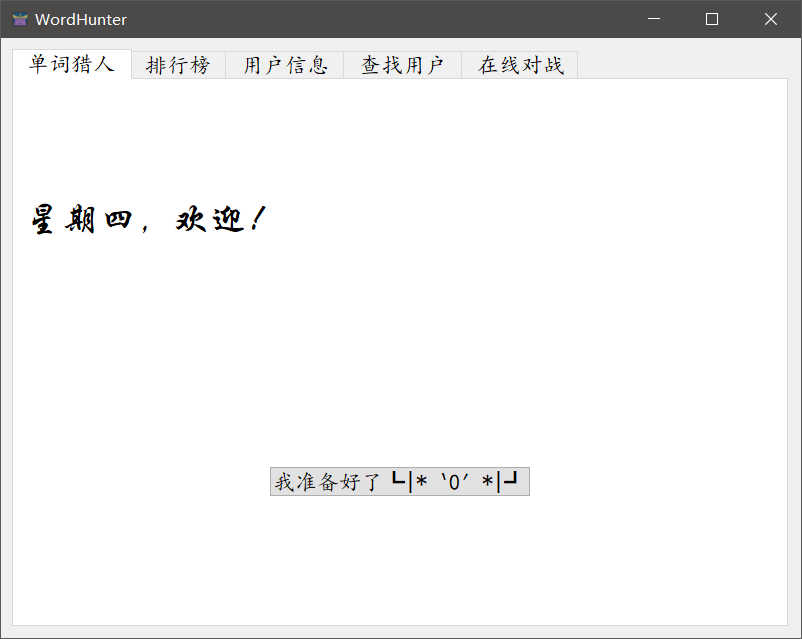

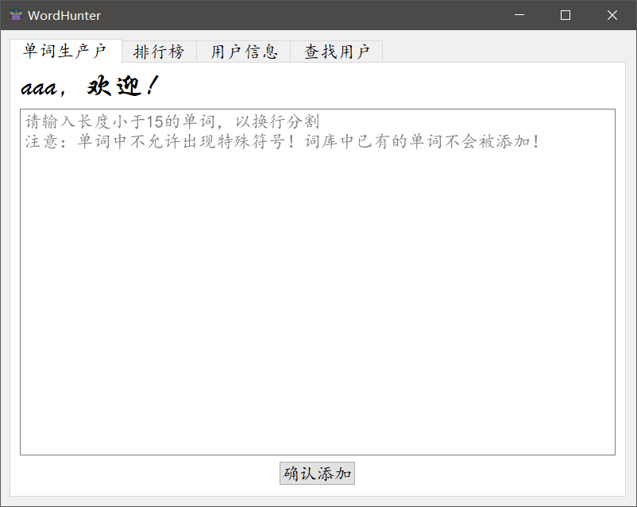

防止用户重复登录

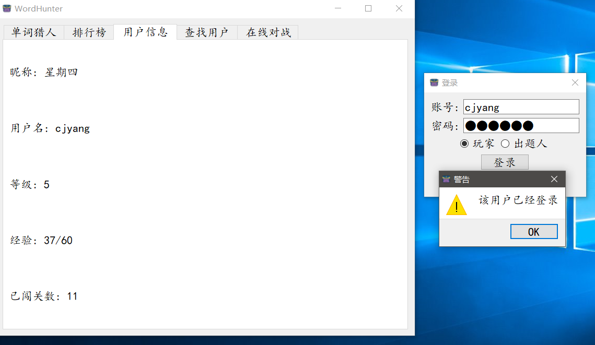

#### 单词猎人

单词猎人即闯关游戏，根据事先设定好的规则会显示题目，
用户答题之后，判断其正确性，更新用户信息如经验加减等

```cpp
class WordHunter: public QWidget
{
    Q_OBJECT

public:
    WordHunter(Gamer *_gamer, QWidget *parent = nullptr);
    ~WordHunter();
protected:
    void initUI();
signals:
private slots:
    /* 处理按钮点击事件 */
    void on_startButton_clicked();
    void on_endButton_clicked();
    void on_submitButton_clicked();
    /* 进度条显示 */
    void countdown();
    /* 从服务器获取单词 */
    void readInfo();
private:
    void startGame();       // 开始游戏
    void endGame();         // 结束游戏
    void showNextWord();    // 显示下一个单词
    bool isCorrect();       // 判断答题是否正确
    void updateInfo(const Gamer &gamer);    // 更新用户信息
private:
    /* 用户信息等 */
    Client *client;
    Gamer *gamer;
    QString word;
    int wordNum;
    int stage;
    bool updating = true;

    /* 按钮等元素及布局 */
    QLabel *welcomeLabel;
    QPushButton *startButton;
    QPushButton *endButton;
    QPushButton *submitButton;
    QLabel *stageLabel;
    QLabel *wordLabel;
    QTimer *countdownTimer;
    QProgressBar *deadlineProgressBar;
    QLineEdit *wordInputLineEdit;
    QGridLayout *wordhunterLayout;
};
```

界面效果及功能展示

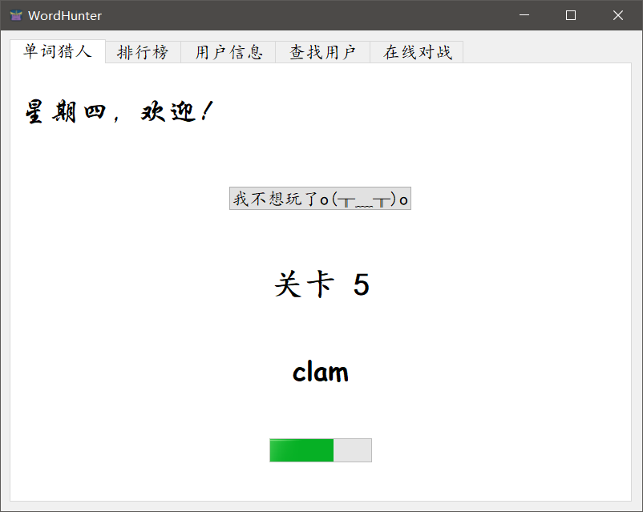

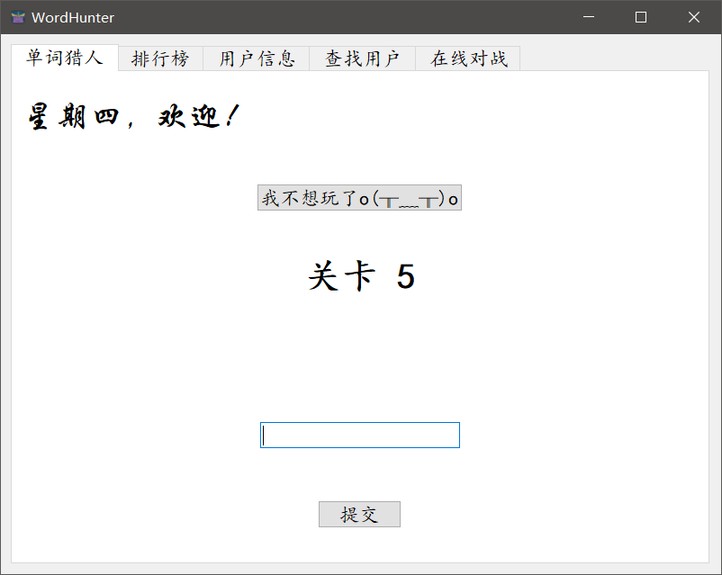

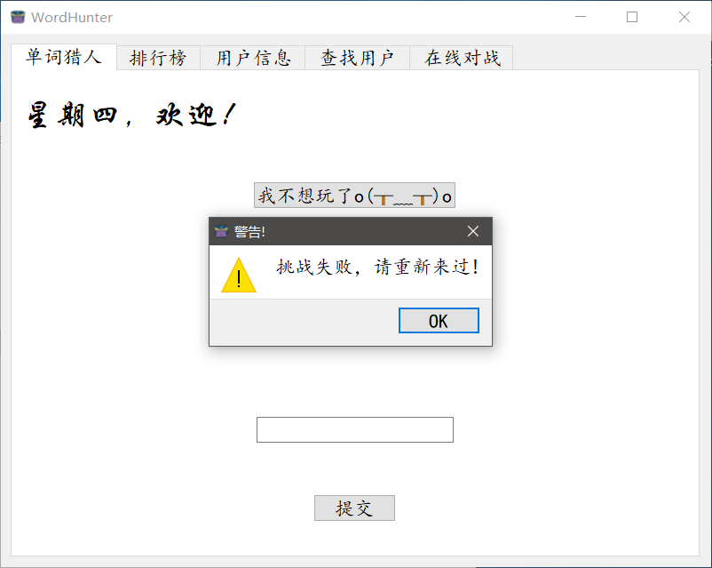

#### 单词生产户

单词生产户即出题功能，用户可以增加词库中没有的单词，
然后获得经验

```cpp
class WordMaker: public QWidget
{
    Q_OBJECT

public:
    WordMaker(Examer *_examer, QWidget *parent = nullptr);
    ~WordMaker();

private:
    bool isValid(const QString &word);      // 判断用户输入合法性
    void updateInfo(const Examer &examer);  // 更新用户信息

public slots:
    /* 按钮点击事件处理 */
    void on_submitButton_clicked();
    /* 向客户端发送单词 */
    void readInfo();

private:
    /* 用户信息等 */
    QString word;
    int successCount;
    bool updating = true;
    bool adding = true;
    Client *client;
    Examer *examer;

    /* 按钮及输入框等元素及其布局 */
    QLabel *welcomeLabel;
    QPushButton *submitButton;
    QGridLayout *wordmakerLayout;

    QPlainTextEdit *wordInputTextEdit;
    QTextDocument *wordInputDoc;
};
```

界面效果及功能展示


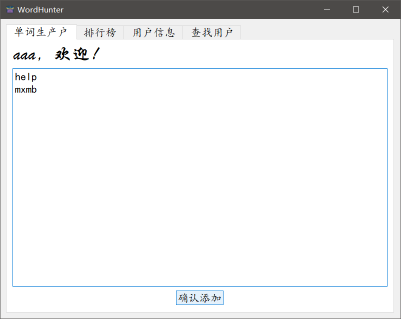

**注意此处，我们输入了两个单词，但是help是词库中已有的单词，**
**它不会被添加，而另一个单词被成功添加。**

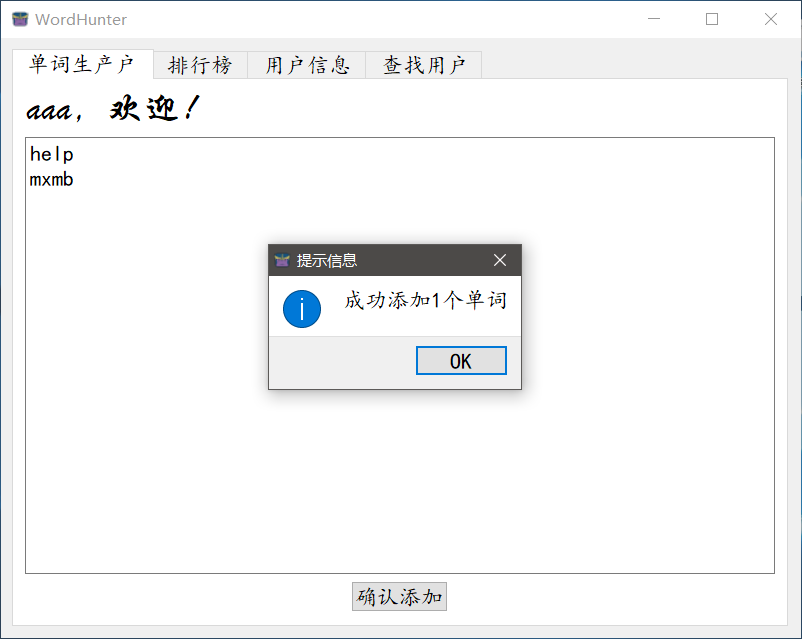

#### 用户信息

在此界面用户，可以查看个人的详细信息

```cpp
class DetailInformation: public QWidget
{
    Q_OBJECT

public:
    DetailInformation(Gamer *_gamer, QWidget *parent = nullptr);
    DetailInformation(Examer *_examer, QWidget *parent = nullptr);
    ~DetailInformation();

    /* 用于用户信息更新之后获取最新的信息 */
    void gamerInfoRefresh();
    void examerInfoRefresh();
private:
    /* 用户信息 */
    Gamer *gamer;
    Examer *examer;

    /* 按钮等元素及其布局 */
    QLabel *nicknameLabel;
    QLabel *usernameLabel;
    QLabel *levelLabel;
    QLabel *expLabel;
    QLabel *passedStageNumLabel;
    QLabel *questionNumLabel;

    QGridLayout *mainLayout;
};
```

界面效果及功能展示

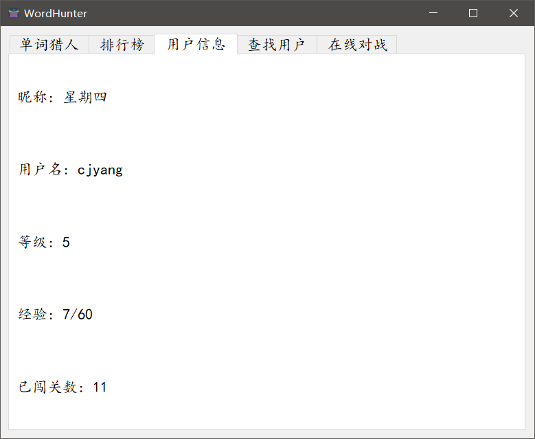

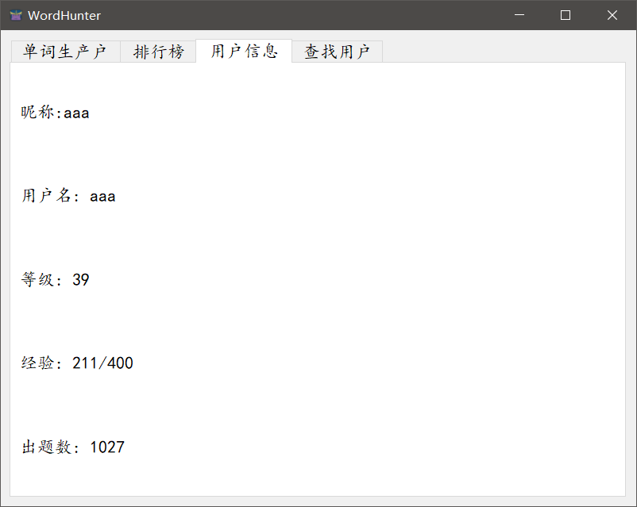

#### 排行榜

在此界面每个用户都可以查看所有的闯关者和出题人，同时可以根据等级、闯关数等，
对所有用户进行排序

```cpp
class RankingList: public QWidget
{
    Q_OBJECT

public:
    RankingList(QWidget *parent = nullptr);
    ~RankingList();
    /* 当其它用户信息更新时更新排行榜 */
    void refreshRanklist();
private slots:
    /* 对用户进行排序 */
    void sortGamerColumn(int index);
    void sortExamerColumn(int index);
    /* 从服务器获取用户列表 */
    void readInfo();
private:
    void initRanklist();
private:
    /* 与服务器通信的客户端 */
    Client *client;
    /* 列表等元素及其布局 */
    QTableWidget *gamerRanklist;
    QTableWidget *examerRanklist;

    QGridLayout *mainLayout;
};
```

界面效果及功能展示

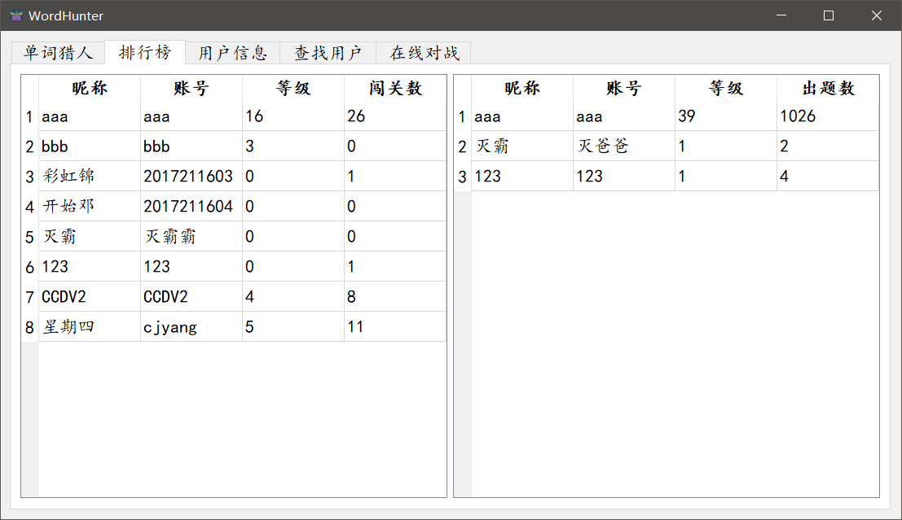

#### 查找用户

根据用户名查找用户，显示用户的个人信息

```cpp
class SearchUser: public QWidget
{
    Q_OBJECT

public:
    SearchUser(QWidget *parent = nullptr);
    ~SearchUser();
private slots:
    /* 点击不同的按钮查找闯关者或出题者 */
    void on_searchGamerButton_clicked();
    void on_searchExamerButton_clicked();
    /* 获取服务器发来的用户信息 */
    void readInfo();
private:
    /* 客户端 */
    Client *client;
    /* 按钮等元素及其布局 */
    QLineEdit *usernameLineEdit;
    QPushButton *searchGamerButton;
    QPushButton *searchExamerButton;
    QGridLayout *searchButton;
    QGridLayout *mainLayout;
};
```

弹出的用户信息窗口

```cpp
class UserInformation : public QDialog
{
    Q_OBJECT
public:
    explicit UserInformation(const Gamer &gamer, QWidget *parent = nullptr);
    explicit UserInformation(const Examer &examer, QWidget *parent = nullptr);

private:
    QLabel *nicknameLabel;
    QLabel *usernameLabel;
    QLabel *levelLabel;
    QLabel *expLabel;
    QLabel *passedStageNumLabel;
    QLabel *questionNumLabel;

    QGridLayout *mainLayout;
};

```

界面效果及功能展示

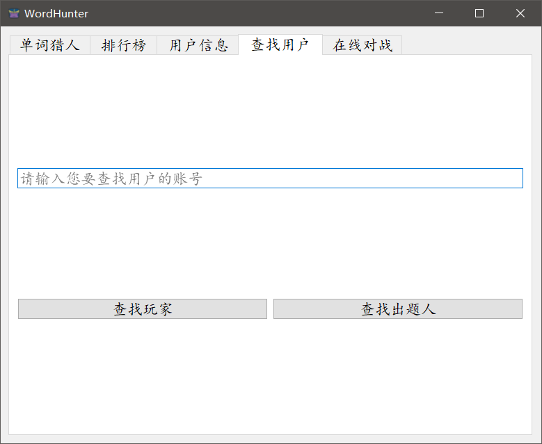

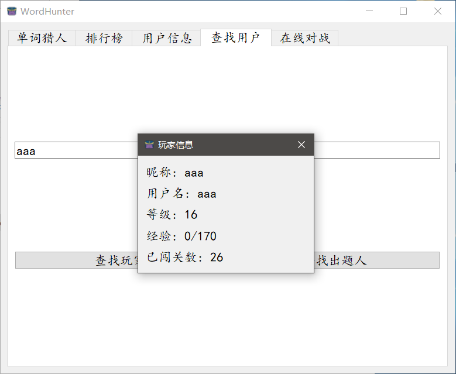

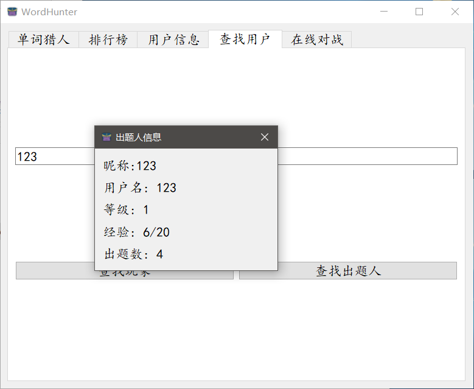

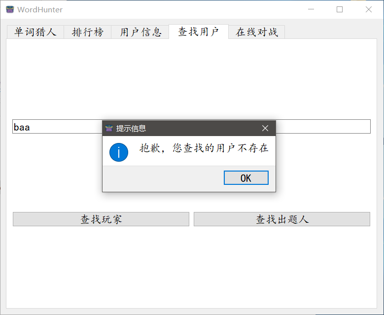

#### 在线对战

用户点击开始匹配后，对服务器发出对战请求，服务器会在其数据库中查找此时是否有
其他用户也在匹配，有则匹配成功，无则让客户端继续等待。用户可以主动取消对战，
服务器会将其从对战列表中移除。匹配成功后，服务器会向两人发出同样的题目，
每个玩家有一分钟的答题时间，超时将自动结束，总共十道题目，正确率优先，
正确率相同时，用时短者获胜，正确率和用时均相同则平局。获胜者加经验，
失败者扣经验，平局经验不变。

```cpp
class OnlineBattle : public QWidget
{
    Q_OBJECT
public:
    explicit OnlineBattle(Gamer *_gamer, QWidget *parent = nullptr);
    ~OnlineBattle();
private:
    /* 显示题目 */
    void initUI();
    void startGame();
    void nextWord();
    void endGame();
    void updateInfo(const Gamer &gamer);
signals:

public slots:
    /* 按钮点击事件处理 */
    void on_matchButton_clicked();
    void on_submitButton_clicked();
    /* 一分钟答题时间超时处理 */
    void on_endGameTimer_timeout();
    /* 进度条减少 */
    void countdown();
    void readInfo();
private:
    Client *client;
    Gamer *gamer;
    bool cancelMatch;
    bool waiting = false;
    QTime timecost;
    QVector<QString> words;
    int wordNum;
    int correctNum;

    QPushButton *matchButton;
    QLabel *wordLabel;
    QTimer *endGameTimer;
    QTimer *countdownTimer;
    QProgressBar *deadlineProgressBar;
    QLineEdit *wordInputLineEdit;
    QPushButton *submitButton;
    QGridLayout *mainLayout;

    WaitingDialog *waitingDialog;
    MatchDialog *matchDialog;
};
```

匹配等待窗口

```cpp
class MatchDialog: public QDialog
{
    Q_OBJECT

public:
    explicit MatchDialog(QWidget *parent = nullptr);
    ~MatchDialog();
private slots:
    void on_cancelButton_clicked();
    void waiting();
private:
    QLabel *waitingLabel;
    QPushButton *cancelButton;
    QGridLayout *mainLayout;
    QTimer *waitingTimer;
};
```

答题完毕等待对方窗口

```cpp
class WaitingDialog: public QDialog
{
    Q_OBJECT

public:
    explicit WaitingDialog(QWidget *parent = nullptr);
    ~WaitingDialog();
    void selfClose();
private slots:
    void waiting();
private:
    QLabel *waitingLabel;
    QTimer *waitingTimer;
    QGridLayout *mainLayout;
};
```

界面效果及功能展示如下

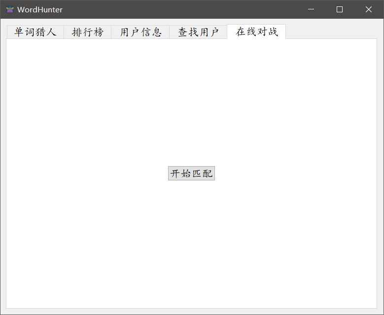

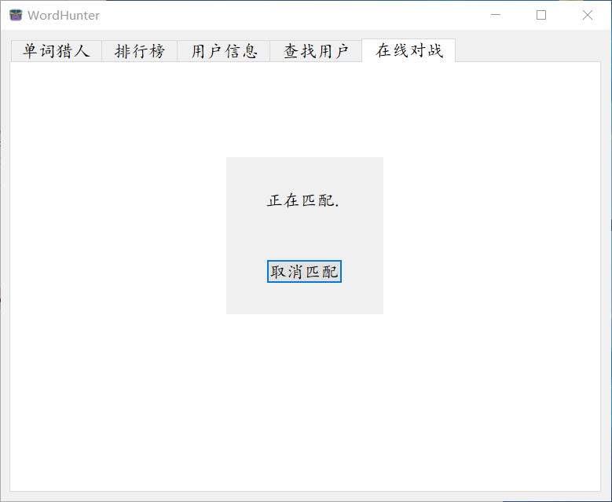

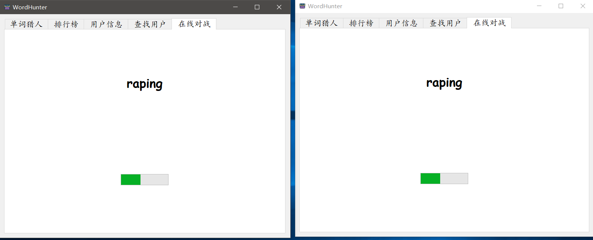

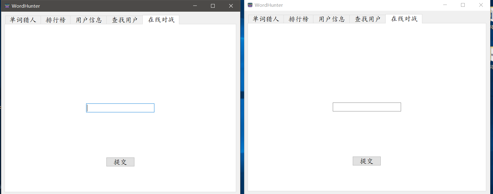

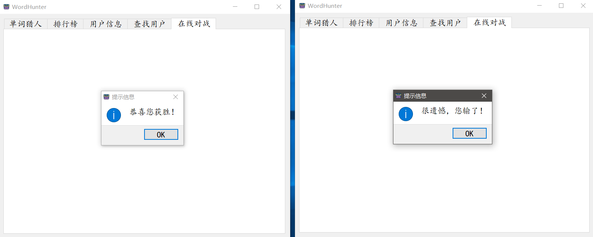

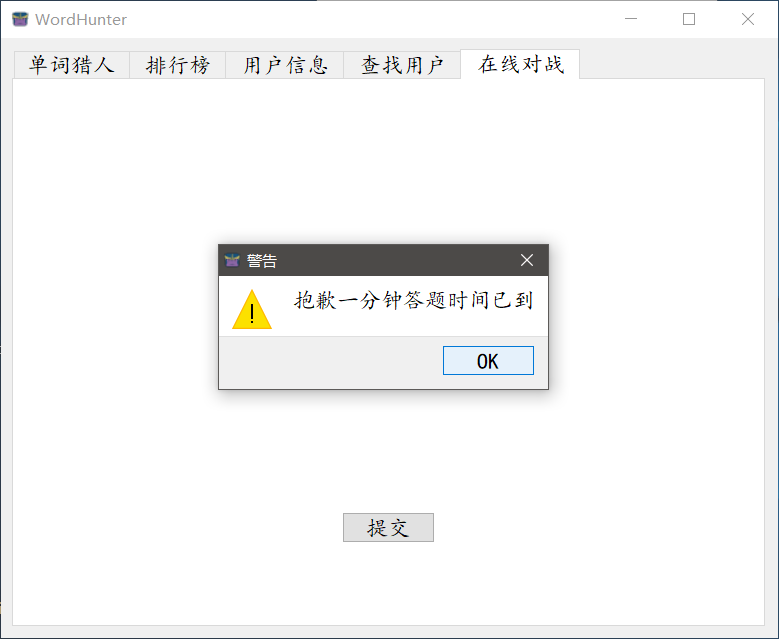

### 服务器端

#### 数据库

用sqllite数据进行用户信息和词库的存储

```cpp
/* 用户状态数据库与客户端相同 */
enum STATE
{
    OFFLINE,
    ONLINE,
    WRONGPASSWD,
    NOUSER,
    MATCHING,
    PKING,
    PKEND,
    MATCHSUCCESS,
    MATCHFAILURE_MATCHING,
    MATCHFAILURE_PKING,
    WIN,
    LOSE,
    DRAW,
    WAIT
};

class Database
{
public:
    Database();
    ~Database();
    void init();
    /* 与服务器的一系列功能相对应，供服务器调用 */
    STATE gamerSignin(QString username, QString password);
    bool gamerSignup(QString nickname, QString username, QString password);
    STATE examerSignin(QString username, QString password);
    bool examerSignup(QString nickname, QString username, QString password);
    void updateInfo(Gamer gamer);
    void updateInfo(Examer examer);
    Gamer getGamerInfo(QString username);
    Examer getExamerInfo(QString username);
    bool addWord(QString word);
    QString getWord(int difficultDegree);
    QVector<Gamer> getGamerRanklist();
    QVector<Examer> getExamerRanklist();
    void gamerSignout(QString username);
    void examerSignout(QString username);
    void addMatchInfo(QString username, int clientNum);
    STATE match(QString username);
    STATE getMatchState(QString username);
    QString getOpponent(QString username);
    int getClientNum(QString username);
    int getCorrectNum(QString username);
    int getTimeCost(QString username);
    void updateMatchInfo(QString username, QString opponent, STATE state, \
                         int correct, int time);
    void removeMatchInfo(QString username);
private:
    QSqlQuery *query;
};
```

#### 服务器

通过socket与客户端进行通信，解析客户端发来的json包，根据功能号调用服务器及
数据库相关函数，向客户端反馈结果。

```cpp
/* 功能号服务器与客户端相同 */
enum FUNCTION
{
    GAMER_SIGNIN,
    EXAMER_SIGNIN,
    GAMER_SIGNUP,
    EXAMER_SIGNUP,
    GAMER_SIGNOUT,
    EXAMER_SIGNOUT,
    GET_GAMERINFO,
    GET_EXAMERINFO,
    ADDWORD,
    GETWORD,
    GET_GAMERRANKLIST,
    GET_EXAMERRANKLIST,
    UPDATE_GAMERINFO,
    UPDATE_EXAMERINFO,
    GAMERMATCH,
    GET_PKRESULT,
    CANCELMATCH,
    UPDATE_PKINFO
};

class Server : public QMainWindow
{
    Q_OBJECT

public:
    explicit Server(QWidget *parent = nullptr);
    ~Server();

    /* 服务器提供的诸如用户登录、匹配等一系列功能 */
    void gamerSignin(int clientNum, QString username, QString password);
    void gamerSignup(int clientNum, QString nickname, QString username, QString password);
    void examerSignin(int clientNum, QString username, QString password);
    void examerSignup(int clientNum, QString nickname, QString username, QString password);
    void getGamerInfo(int clientNum, QString username);
    void getExamerInfo(int clientNum, QString username);
    void addWord(int clientNum, QString word);
    void getWord(int clientNum, int difficultDegree);
    void gamerSignout(int clientNum, QString username);
    void examerSignout(int clientNum, QString username);
    void updateGamerInfo(int clientNum, Gamer gamer);
    void updateExamerInfo(int clientNum, Examer examer);
    void updatePkInfo(Gamer gamer);
    void getGamerRanklist(int clientNum);
    void getExamerRanklist(int clientNum);
    void match(int clientNum, QString username);
    void getPkResult(QString username, int correctNum, int time);
    void cancelMatch(QString username);
protected:
    void initServer();
private:
    /* 向客户端发送消息 */
    void sendInfo(QJsonObject infoObject, int clientNum);
    void sendInfo(QJsonArray infoArray, int clientNum);
private slots:
    /* 按钮点击时间的处理 */
    void on_startButton_clicked();
    void on_endButton_clicked();
    /* 与客户端建立链接 */
    void acceptConnection();
    /* 接收客户端信息进行处理 */
    void receiveInfo();
    /* 显示错误信息 */
    void displayError(QAbstractSocket::SocketError);
    /* 断开与客户端的链接 */
    void disconnection();
private:
    /* 服务器、socket等 */
    QTcpServer *server;
    QList<QTcpSocket*> client;
    QTcpSocket *infoReceiver;

    /* 按钮等元素及布局 */
    QPushButton *startButton;
    QPushButton *endButton;
    QComboBox *clientComboBox;

    QGridLayout *serverLayout;
    QWidget *centralWidget;
};
```

界面效果及功能展示

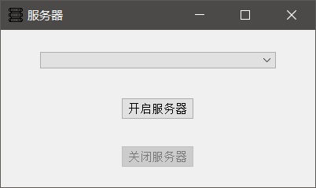

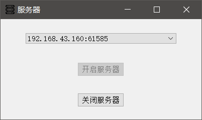
